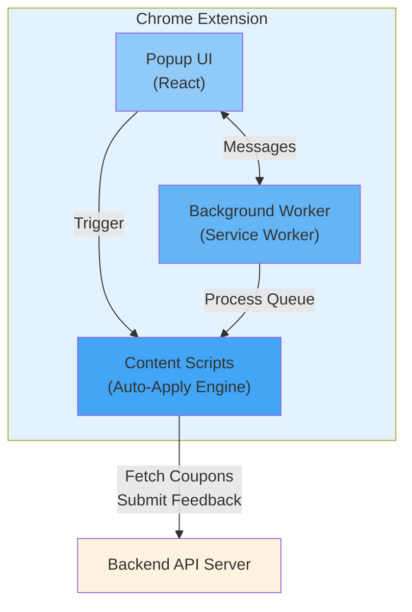

# OpenCoupon - Chrome Extension (Frontend)

This directory contains the Chrome Extension frontend for OpenCoupon - a production-ready, security-hardened browser extension for automatic coupon application at checkout.

## Architecture

The extension follows Chrome's **Manifest V3** standards and consists of four main components:



### Component Breakdown

#### 1. **Content Scripts** (`src/content/`)

The core auto-apply engine that runs on e-commerce checkout pages.

- **`detector.ts`**: Multi-strategy coupon field detection
  - Retailer-specific CSS selectors (100% confidence)
  - Attribute-based keyword matching (70-90% confidence)
  - Label-based detection (60% confidence)
  - Cache results in `chrome.storage.session` to avoid race conditions
  - Security: Validates all DOM elements before interaction

- **`applier.ts`**: Automated coupon testing loop
  - Sorts coupons by success rate and recency
  - Applies each coupon and monitors price changes
  - Uses `MutationObserver` with proper cleanup to detect discounts
  - Reports best coupon found
  - Tracks success/failure for feedback

- **`AutoApplyManager.tsx`**: Orchestrates the auto-apply flow
  - Listens for messages from popup
  - Renders progress overlay (`AutoApplyOverlay.tsx`)
  - Shows results (`AutoApplyResult.tsx`)
  - Security: Validates all incoming messages from popup

- **`feedbackIntegration.ts`**: Feedback submission handler
  - Submits anonymous feedback to backend API
  - Queues failed submissions for retry
  - Respects rate limits

#### 2. **Background Service Worker** (`src/background/`)

Long-lived background process for extension-wide tasks.

- **`service-worker.ts`**:
  - Manages feedback queue processing (every 15 minutes)
  - Handles alarm-based background jobs
  - Security: Validates message senders
  - Cleans up expired cache entries

#### 3. **Popup UI** (`src/popup/`)

User interface displayed when clicking the extension icon.

- **`Popup.tsx`**: Main popup component
  - Fetches coupons for current domain
  - Displays available coupons with success rates
  - Triggers auto-apply when user clicks "Find Coupons"
  - Shows loading states and error messages

- **`components/`**: Reusable UI components
  - `CouponList.tsx`: Displays list of available coupons
  - `AutoApplyOverlay.tsx`: Floating progress indicator during auto-apply
  - `AutoApplyResult.tsx`: Results modal showing best coupon found

#### 4. **Services** (`src/services/`)

API communication layer.

- **`api.ts`**: Backend API client
  - Fetches coupons for domains
  - Uses environment-based API URLs (dev/prod)
  - Client-side rate limiting (20 req/min)
  - Error handling and retries

- **`feedback.ts`**: Feedback submission service
  - Submits coupon success/failure feedback
  - Client-side rate limiting (50 req/min)
  - Queues failed submissions

#### 5. **Utils** (`src/utils/`)

Shared utilities and security functions.

- **`security.ts`**: Security validation utilities
  - `isValidMessageSender()`: Prevents unauthorized extension messages
  - `isValidDOMElement()`: Validates DOM elements for XSS prevention
  - `isValidCouponsArray()`: Validates API response structure
  - `sanitizeErrorMessage()`: Prevents information disclosure

- **`rateLimiter.ts`**: Client-side rate limiting
  - `RateLimiter` class with sliding window algorithm
  - Prevents API abuse
  - Configurable limits per endpoint

- **`feedbackQueue.ts`**: Offline feedback queue management
  - Stores failed feedback submissions
  - Retries up to 3 times with exponential backoff
  - Auto-cleanup of expired items (7 days)

## Project Structure

```
client/
├── public/
│   └── icons/              # Extension icons (16x16, 48x48, 128x128)
├── src/
│   ├── assets/             # Static assets
│   │   └── logo.png        # OpenCoupon logo
│   ├── background/         # Background service worker
│   │   └── service-worker.ts
│   ├── components/         # Shared React components
│   │   └── ui/             # UI primitives
│   ├── config/             # Environment configuration
│   │   └── index.ts        # API URL config (dev/prod)
│   ├── content/            # Content scripts (auto-apply engine)
│   │   ├── components/     # Content script UI components
│   │   │   ├── AutoApplyOverlay.tsx
│   │   │   └── AutoApplyResult.tsx
│   │   ├── applier.ts      # Coupon auto-apply logic
│   │   ├── detector.ts     # Coupon field detection
│   │   ├── AutoApplyManager.tsx
│   │   ├── feedbackIntegration.ts
│   │   └── main.tsx        # Content script entry point
│   ├── popup/              # Extension popup UI
│   │   ├── Popup.tsx       # Main popup component
│   │   └── index.tsx       # Popup entry point
│   ├── services/           # API clients
│   │   ├── api.ts          # Backend API client
│   │   └── feedback.ts     # Feedback submission
│   ├── utils/              # Utilities and helpers
│   │   ├── security.ts     # Security validation
│   │   ├── rateLimiter.ts  # Rate limiting
│   │   └── feedbackQueue.ts # Feedback queue management
│   └── types.ts            # TypeScript type definitions
├── dist/                   # Built extension (load in Chrome)
├── .env                    # Development environment config
├── .env.example            # Environment config template
├── .env.production         # Production environment config
├── manifest.config.ts      # Manifest V3 configuration
├── vite.config.ts          # Vite build configuration
├── tailwind.config.js      # Tailwind CSS configuration
├── tsconfig.json           # TypeScript configuration
└── package.json            # Dependencies and scripts
```

## Setup and Development

### Prerequisites

- Node.js 20+
- Chrome Browser
- Running backend server (see [../server/README.md](../server/README.md))

### Installation

1. **Install dependencies**

   ```bash
   cd client
   npm install
   ```

2. **Configure environment**

   ```bash
   cp .env.example .env
   ```

   Edit `.env`:

   ```bash
   VITE_API_BASE_URL=http://localhost:3030/api/v1
   VITE_ENV=development
   ```

3. **Start development build**

   ```bash
   npm run dev
   ```

   This starts Vite in watch mode. Changes to source files will automatically rebuild the extension.

4. **Load extension in Chrome**
   - Navigate to `chrome://extensions/`
   - Enable "Developer mode" (toggle in top-right)
   - Click "Load unpacked"
   - Select the `client/dist` folder
   - The extension should appear in your toolbar

5. **Test the extension**
   - Visit any e-commerce checkout page
   - Click the OpenCoupon icon in the toolbar
   - Click "Auto-Apply Coupons" to test auto-apply

### Development Commands

```bash
# Start development build (watch mode)
npm run dev

# Production build
npm run build

# Run tests
npm test

# Run tests with UI
npm run test:ui

# Generate coverage report
npm run test:coverage

# Lint code
npm run lint
```

### Hot Reload

To reload the extension after code changes:

1. **Content Scripts**: Refresh the webpage
2. **Popup UI**: Close and reopen the popup
3. **Background Worker**: Go to `chrome://extensions/` and click the reload icon
4. **Manifest Changes**: Full extension reload required

**Tip**: Install [Extensions Reloader](https://chrome.google.com/webstore/detail/extensions-reloader/fimgfedafeadlieiabdeeaodndnlbhid) for quick reloads during development.

## Security Features

OpenCoupon implements multiple security layers to protect users:

### 1. **Minimal Permissions** (Manifest V3)

Only requests necessary permissions:

- `activeTab`: Access current tab when user clicks extension
- `storage`: Store user preferences and queue
- `alarms`: Background queue processing
- `sidePanel`: Display side panel UI

**No access to**:

- Browsing history
- All tabs (only active tab)
- File system
- Other extensions

### 2. **Message Sender Validation**

All messages between components are validated:

```typescript
if (!isValidMessageSender(sender)) {
  // Reject messages from unauthorized sources
  return;
}
```

### 3. **DOM Element Validation**

Prevents XSS attacks by validating DOM elements:

```typescript
if (!isValidDOMElement(element)) {
  // Reject cross-origin or malicious elements
  return;
}
```

### 4. **Input Sanitization**

All user inputs and API responses are validated:

- API responses validated with Zod schemas
- Error messages sanitized to prevent info disclosure
- Coupon codes sanitized before DOM insertion

### 5. **Rate Limiting**

Client-side rate limiting prevents API abuse:

- API requests: 20 per minute
- Feedback submissions: 50 per minute

### 6. **Environment-Based Configuration**

API URLs are environment-specific:

- Development: `http://localhost:3030/api/v1`
- Production: `https://api.opencoupon.com/api/v1`

No hardcoded URLs in source code.

## Testing

### Unit Tests

Tests are written with **Vitest** and **React Testing Library**.

**Example test** (`detector.test.ts`):

```typescript
describe('findCouponElements', () => {
  it('should detect coupon input by id attribute', async () => {
    document.body.innerHTML = `
      <input id="promo-code" type="text" />
      <button type="submit">Apply</button>
    `;
    const result = await findCouponElements();
    expect(result.inputElement).toBeTruthy();
    expect(result.confidence).toBeGreaterThan(50);
  });
});
```

### Integration Tests

Test the full auto-apply flow in a simulated environment.

### Running Tests

```bash
# Run all tests
npm test

# Coverage report
npm run test:coverage

# Interactive UI
npm run test:ui
```

### Test Coverage Goals

- **Detector**: >90% coverage
- **Applier**: >80% coverage
- **Security Utils**: 100% coverage
- **Services**: >85% coverage

## Deployment

### Production Build

1. **Update environment**

   ```bash
   cp .env.production .env
   ```

2. **Build extension**

   ```bash
   npm run build
   ```

3. **Test production build**
   - Load `dist/` folder in Chrome
   - Test on multiple sites
   - Verify API calls go to production server

### Publishing to Chrome Web Store

1. **Create ZIP file**

   ```bash
   cd dist
   zip -r ../opencoupon-extension.zip .
   ```

2. **Upload to Chrome Web Store**
   - Go to [Chrome Developer Dashboard](https://chrome.google.com/webstore/devconsole)
   - Create new item or update existing
   - Upload `opencoupon-extension.zip`
   - Fill in store listing details
   - Submit for review

3. **Review Process**
   - Google reviews extensions (typically 1-3 days)
   - Address any feedback
   - Once approved, extension is live

### Version Management

Update version in `manifest.config.ts` before each release:

```typescript
version: '1.2.0', // Follow semver
```

## Debugging

### Chrome DevTools

**Content Scripts**:

1. Right-click on webpage → "Inspect"
2. Go to "Sources" tab
3. Find extension files under `Content Scripts`
4. Set breakpoints and debug

**Popup**:

1. Right-click extension icon → "Inspect popup"
2. Debug React components with React DevTools

**Background Worker**:

1. Go to `chrome://extensions/`
2. Find OpenCoupon
3. Click "service worker" link
4. Console opens with background worker logs

### Console Logging

All components use prefixed logging:

- `[OpenCoupon]` - General messages
- `[Detector]` - Coupon field detection
- `[Applier]` - Auto-apply loop
- `[API]` - API requests
- `[Queue]` - Feedback queue
- `[Security]` - Security validations

**Example**:

```typescript
console.log('[OpenCoupon] Starting auto-apply with', coupons.length, 'coupons');
```

### Common Issues

**Issue**: Extension not loading

- **Fix**: Check `manifest.config.ts` syntax errors. Run `npm run build` and check console.

**Issue**: Content script not injecting

- **Fix**: Verify `matches` pattern in `manifest.config.ts`. Refresh webpage after loading extension.

**Issue**: API requests failing

- **Fix**: Check `.env` file has correct `VITE_API_BASE_URL`. Verify backend server is running.

**Issue**: Coupon field not detected

- **Fix**: Open DevTools → Console. Look for `[Detector]` logs. Inspect page HTML to identify field selectors.

## Contributing

We welcome contributions to improve the extension!

### Contribution Areas

- **UI/UX Improvements**: Enhance popup and overlay components
- **More Advanced Coupon Field Detection**: Improve field detection algorithms and approaches
- **Testing**: Add test coverage for new features
- **Documentation**: Improve inline comments and guides

### Development Workflow

1. Fork the repository
2. Create feature branch: `git checkout -b feature/my-feature`
3. Make changes and test thoroughly
4. Run linter: `npm run lint`
5. Run tests: `npm test`
6. Commit with clear message
7. Push and create Pull Request

### Code Style

- **TypeScript**: Strict mode enabled
- **React**: Functional components with hooks
- **Naming**: camelCase for variables, PascalCase for components
- **Comments**: JSDoc for public functions
- **Formatting**: Prettier (runs on save)

## License

MIT License - see [../LICENSE](../LICENSE) for details.

---

**Need Help?** Check the [main README](../README.md) or open an issue on GitHub.
